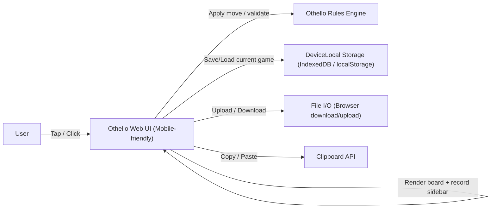

# ARCHITECTURE_DIAGRAM.md

<!--
このファイルでは、システムを構成する主要コンポーネントとデータフローを
mermaid の flowchart で記述する (UML コンポーネント図/配置図の簡易版)。

目的:
- どんな「箱」があり、どの方向にデータやメッセージが流れるかを俯瞰する。
- USE_CASES.md の Operations と REQUIREMENT.md の Public Operations を
  どのコンポーネント間のやりとりとして実現するかをイメージしやすくする。

ルール:
- ノードはコンポーネントを表す (例: Frontend, API Server, GameServer, DeviceController 等)。
- 外部サービスや外部デバイスはノード名に「(外部)」を付ける。
  - 例: AuthService(外部), PaymentAPI(外部), SensorUnit(外部)
- 矢印は「依存関係 / 呼び出し方向」を表し、ラベルに代表的な操作やプロトコル名を書くとよい。
  - 例: |HTTP /api/login|, |gRPC Match|, |WebSocket|, |I2C Read| など。
-->

